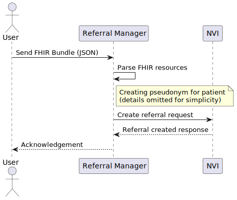
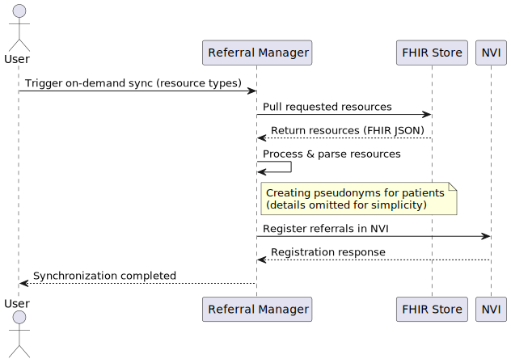
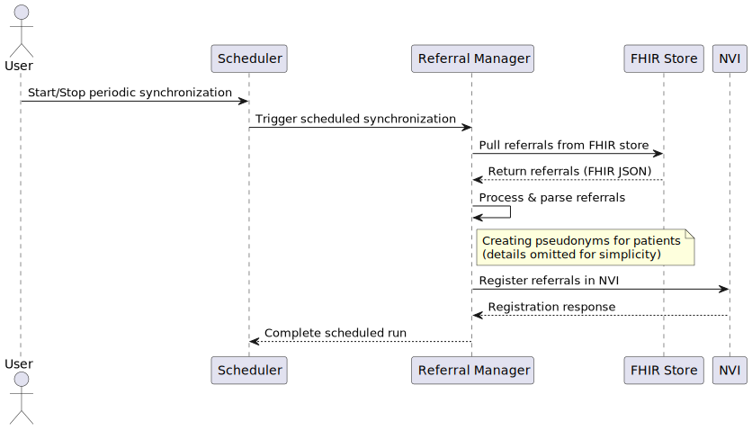
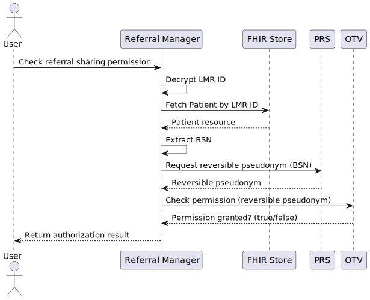

# Flows

The NVI referral manager flows can be divided into two main categories: authorization checks and referral registrations. Both processes involve pseudonymization to ensure patient privacy. The flows are described in below.

The pseudonymization creation is omitted in the diagrams for simplicity but can be found in detail in the [Pseudonymization flow](./pseudonymization-flows.md) documentation.

1. [**Authorization Check**](#authorization-check)
2. [**Registration**](#registration)

## Registration

There are three different types of ways the NVI referral manager can register referrals in the NVI:

1. [**Send data registration**](#send-data-registration)
2. [**On-demand synchronization**](#on-demand-synchronization)
3. [**Periodical synchronization**](#periodical-synchronization)

### Send data registration

In this flow, a user manually uploads a FHIR resource with patient reference to the NVI Referral manager, which parses it and on success sends one create referral request to the NVI.
  

### On-demand synchronization

In this flow, a user manually triggers the synchronization of one or more resource types, the NVI referral manager pulls the requested resources from a FHIR store and registers them in the NVI.

### Periodical synchronization

In this flow, the NVI referral manager periodically synchronizes referrals from a FHIR store and registers them in the NVI as a background task. A user can start or stop the scheduler manually.

## Authorization Check

When checking if a patient has given permission to share referrals with a certain organization, the NVI referral manager follows this pseudonymization flow:

1. **Receive request** - The NVI referral manager receives a request containing the encrypted patient identifier and an organization identifier.
2. **Decrypt internal patient identifier** - The NVI referral manager decrypts the internal patient identifier using its symmetric key.
3. **Fetch Patient from FHIR store** - The NVI referral manager fetches the Patient resource from the FHIR store using the decrypted internal patient identifier.
4. **Extract BSN** - The Patient's BSN is extracted.
5. **Create reversible pseudonym** - The NVI referral requests a reversible pseudonym specific for the online-toestemmingsvoorziening(OTV) for the BSN from the Pseudoniemendienst (PRS).
6. **Check authorization** - The NVI referral manager checks with the OTV if the patient has given permission to share referrals with the specified organization. This results in an authorization status that is sent back in the response.

See the diagram below for a visual representation of the authorization check:

