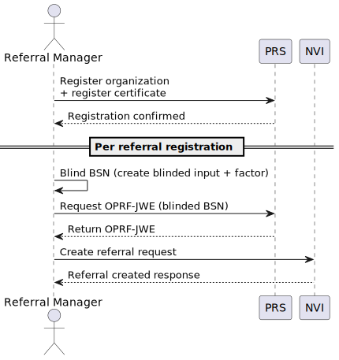

# Pseudonymization flows

Pseudonymization is used for two main processes in the NVI-RS: referral registration and authorization checks. Their pseudonymization flows are described below.

- [Referral Registration](#referral-registration)
- [Authorization Check](#authorization-check)

## Referral Registration

The NVI-RS pseudonymizes patient identifiers before registering them as referrals in the NVI.
This process ensures patient privacy and compliance with data protection regulations. The pseudonymization flow involves the following steps:

1. **Register at PRS** - The NVI-RS sends a request to the Pseudoniemendienst (PRS) to register the itself as an organization, after which it registers its certificate. This step is done once during the initial setup and is not needed for each referral registration.
2. **Encrypt internal patient identifier** - For each to-be-registered referral, the NVI-RS encrypts the internal patient identifier from the FHIR store using a symmetric key.
3. **Encrypt BSN** - The NVI-RS creates a blinded input and blinded factor from the BSN.
4. **Request OPRF-JWE** - The NVI-RS sends the blinded BSN to the PRS and requests an OPRF-JWE.
5. **Register referral** - The NVI-RS sends a create referral request to the NVI.

See the diagram below for a visual representation of the pseudonymization flow during referral registration:

## Authorization Check

When checking if a patient has given permission to share referrals with a certain organization, the NVI-RS follows this pseudonymization flow:

1. **Create reversible pseudonym** - The NVI referral requests from the Pseudoniemendienst (PRS) a reversible pseudonym specific for the patients BSN and the online-toestemmingsvoorziening(OTV).
2. **Check authorization** - The received pseudonym is then used to check with the OTV.

See the diagram below for a visual representation of the pseudonymization flow during authorization checks:

